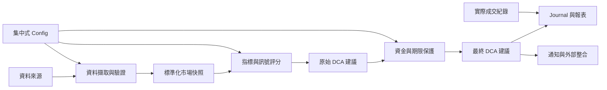

# Bitcoin Smart DCA Engine Architecture

## 1. 文件目的

本文件定義 Bitcoin Smart DCA Engine 的高階系統邊界與演進方向。Stage 2.1 的公式、因子角色、資料來源與容量規則已於 2026-08-02 核准為設計基準；權重、門檻、倍率與 hard-cap 金額仍是待回測或營運驗證的草案預設值。部署方式與實作語言留待後續階段確認。

## 2. 系統邊界

系統負責：

- 接收並驗證市場及投資組合資料。
- 將不同指標轉換為可比較的決策訊號。
- 產生每日原始 DCA 建議。
- 套用每日、每週、剩餘資金與期限限制。
- 保存建議、原因、實際投入及投資進度。
- 產生每日通知及週／月摘要所需資料。

系統目前不負責：

- 自動向交易所送單。
- 保證報酬或預測市場高低點。
- 將 TradingView Pine Script 當作唯一決策來源。
- 在資料缺失時自行猜測市場指標。
- 以 AI 輸出直接取代可稽核的資金保護規則。

## 3. 邏輯分層

### 3.1 資料來源層

預留以下來源，但不在第 1 階段選定供應商或串接方式：

- BTC 市價與 OHLCV
- Fear & Greed Index
- BVIV
- ATR 與單日漲跌幅所需行情
- 投資組合與實際成交資料
- TradingView Alert

### 3.2 資料擷取與驗證層

不同外部來源透過獨立 Adapter 轉成內部格式。每份資料都應包含來源、擷取時間、資料時間與有效狀態，避免外部 API 格式滲入決策核心。

### 3.3 標準化與評分層

價格位置、Fear & Greed 與下跌衝擊形成方向性分數。ATR drop 與 absolute daily drop 可以分別計算及測試，但只能在同一 Shock group 內合併；v1.0 使用兩者的最大值，不得當作兩個獨立加權因子。BVIV 保持為可獨立測試的非方向性 modifier，不得直接加入方向性分數，也不得在 v1.0 放大 Adaptive 金額。

### 3.4 決策層

決策層以 Base DCA 為起點，結合已啟用訊號產生「限制前建議金額」。每項調整都必須輸出原因與貢獻值，不能只保存最終金額。

### 3.5 資金與期限保護層

此層是不可被通知、Dashboard 或未來 AI Agent 繞過的最終控制點，至少預留：

- 每日最大投入
- 每週最大投入
- 可用資金上限
- 剩餘天數與最低必要投入速度
- 最終日在每日與每週 hard caps 內投入；若剩餘資金超出可用容量，標記 `plan_infeasible`，不得自動突破限制
- 金額精度與邊界處理

限制套用前後的金額與原因都必須保存。

### 3.6 紀錄與輸出層

Journal 分開保存系統建議與實際成交。通知、Weekly Report、Monthly Report 與 Dashboard 應讀取同一份標準化紀錄，不各自重新計算策略結果。

## 4. 資料流原則

每日流程預計遵循：

1. 取得指定決策時間點可用的市場資料。
2. 驗證資料完整性、新鮮度與來源。
3. 建立不可變的每日市場快照。
4. 依當日有效 Config 計算各因子分數。
5. 產生限制前建議金額與原因。
6. 套用資金及期限保護，得到最終建議。
7. 保存決策紀錄後，才產生通知。
8. 實際買入完成後，另行補登成交資訊。

任何步驟失敗都應留下可辨識狀態，不得以零值冒充有效指標。

## 5. 模組邊界

未來程式實作應至少維持以下責任邊界，實際資料夾與介面名稱待實作階段確認：

| 模組 | 單一責任 |
|---|---|
| Data Providers | 從外部來源取得原始資料 |
| Validators | 驗證格式、時間與合理範圍 |
| Indicators | 計算或標準化個別指標 |
| Decision Engine | 組合訊號並產生原始建議 |
| Budget Guard | 執行資金及期限限制 |
| Portfolio Ledger | 記錄實際投入、BTC 數量與成本 |
| Journal | 保存每日決策與執行結果 |
| Reporters | 由 Journal 產生週／月摘要 |
| Notifiers | 格式化並傳送簡潔通知 |
| Integrations | 對接 Sheets、TradingView、n8n 等外部系統 |

## 6. Config 與版本治理

- 可調參數集中管理，禁止散落於決策程式。
- 每次決策紀錄所使用的 Config 版本。
- 參數變更先更新規格與 `decision_log.md`，再修改實作。
- 密鑰與 Token 不可寫入 Config 文件或版本控制。
- AI Agent 未來只能提出建議；若要影響金額，必須經明確、版本化且受 Budget Guard 約束的介面。

## 7. 可測試性要求

後續實作需支援：

- 相同市場快照與 Config 產生相同結果。
- 各指標可獨立使用固定輸入測試。
- Budget Guard 可針對期間首日、中途、最後一日及資金不足等邊界測試。
- 外部 API 與通知失敗不改變已保存的決策結果。
- 報表由既有 Journal 產生，不重新呼叫即時資料。

## 8. 外部整合方向

| 整合 | 預定角色 | 邊界原則 |
|---|---|---|
| Google Sheets | 檢視、人工維護或同步資料 | 不直接承載決策公式 |
| TradingView | Alert 或市場訊號來源 | 不作唯一狀態儲存 |
| Coinbase Exchange | v1.0 canonical BTC 行情來源 | 固定使用 `BTC-USD`；不可靜默跨交易所切換 |
| CoinGecko API | 未來可能的 BTC 備援來源 | v1.0 禁用；必須經新 Config 版本與 ADR 核准 |
| Fear & Greed API | 情緒指標來源 | 保存來源時間與有效性 |
| BVIV | 非方向性波動 modifier 來源 | 不加入方向分數；缺失時 modifier 為 1.0 並標記降級 |
| Telegram / LINE | 每日通知管道 | 只讀取已完成決策 |
| n8n | 排程及流程協調 | 不內嵌核心決策規則 |
| Dashboard | 進度與績效呈現 | 讀取標準化紀錄 |
| AI Agent | 解釋、檢查與未來建議 | 不繞過硬性資金限制 |

## 9. 核准與後續驗證狀態

- 因子分組、BVIV 非方向性限制與 Shock 去重：Stage 2.1 設計已核准；數值待回測
- 指標缺失時的降級或停止架構：Stage 2.1 設計已核准；新鮮度數值待驗證
- 每日、每週 hard caps 與全期容量檢查：Stage 2.1 設計已核准；hard-cap 金額待驗證
- 週進度、期限調速、`minimum_required_today` 及最終日不覆寫限制：Stage 2.1 設計已核准；比例與門檻待回測
- Coinbase `BTC-USD` canonical source 與 21:00 cutoff：Stage 2.1 設計已核准
- Journal 的 canonical storage 格式
- 21:00 cutoff 的實際排程、失敗重試與告警政策
- 實作語言與部署方式
